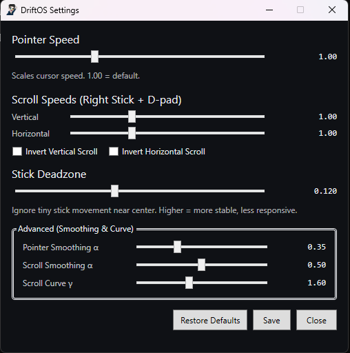

# DriftOS

Turn your Xbox/PC controller into a precision mouse + scroll controller for Windows.  
Lightweight WPF tray app • .NET 8 • no admin required.



---

## ✨ Features

- **Left stick → mouse cursor** with smoothing and configurable speed.
- **RB toggle** to enable/disable input injection (sticky toggle; no “hold” needed).
- **Right stick → scrolling** (vertical + horizontal) with per-axis speed and invert.
- **Deadzone control** to kill drift near center.
- **Smoothing & curve** (α / γ) for both pointer and scroll to feel natural.
- **Tray icon** with: Enable/Disable, Settings, Exit.
- **Persisted settings** at `%APPDATA%\DriftOS\config.json`.
- **Structured logs** at `%APPDATA%\DriftOS\logs\driftos-*.log` (Serilog).

---

## 🖱️ Controls (default)

| Controller | Action |
|---|---|
| **Left Stick** | Move mouse cursor |
| **Right Stick** | Scroll (up/down & left/right) |
| **RB** | Toggle DriftOS on/off |
| **Tray Icon** | Right-click → Enable/Disable • Settings • Exit |

> Toggle **off** fully releases any buttons/scroll state to avoid “stuck click” or scroll.

---

## 🔧 Settings (what they do)

| Setting | Description | Typical Range |
|---|---|---|
| **Pointer Speed** | Scales cursor speed (1.00 = default) | 0.6–1.8 |
| **Scroll Speed – Vertical/Horizontal** | Scales scroll rate per axis | 0.6–2.0 |
| **Invert Vertical/Horizontal** | Reverses scroll direction per axis | On/Off |
| **Stick Deadzone** | Ignores tiny stick movement near center | 0.08–0.18 |
| **Pointer Smoothing α** | EMA smoothing for cursor (higher = snappier) | 0.30–0.55 |
| **Scroll Smoothing α** | EMA smoothing for scroll | 0.45–0.65 |
| **Scroll Curve γ** | Shapes stick→scroll response (lower = more mid-stick) | 1.3–2.2 |

Click **Save** to persist to `config.json` (path is confirmed in a toast and logged).

---

## 🏗️ Build & Run

**Requirements**
- Windows 10/11
- .NET SDK 8.x (or newer)
- XInput-compatible controller (Xbox/PC)

**Using CLI**
```powershell
git clone https://github.com/josepraveenkaruppiah/DriftOS.git
cd DriftOS
dotnet build
dotnet run -p .\DriftOS.App

## ⬇️ Download
Grab the latest from [Releases](../../releases) — use **Self-contained (win-x64)** if you’re not sure.
